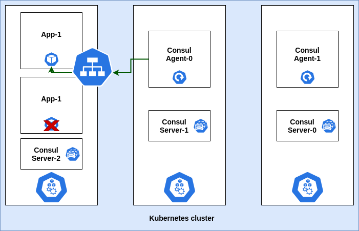
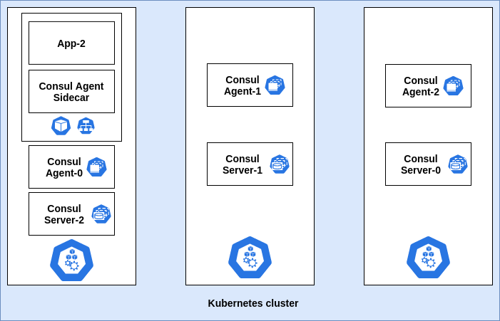

# Consul Deployment patterns

While delving into service mesh or key-value store or a service discovery solution in cloud native space, you would have definitely come across Consul. Consul, developed by Hashicorp is a multi-purpose solution which primarily provide following features:

- Service discovery and Service Mesh features with Kubernetes
- Secure communication and observability between the services
- Automate load-balancing
- Key-Value store
- Consul Watches

In this blogpost we will see how the Consul can be deployed for different scenarios.

## In cluster patterns

Briefly speaking Consul KV provides a simple way to store namepaced or hierarchical configurations/properties in any form including string, JSON, YAML and HCL.

A complementary feature for KV is Watches. As the name suggests, it watches (monitor) the values of the keys stored in KV. Watches notify changes occurred in one or more keys. In addition to this, we can also watch services, nodes, events, etc. Once, a notification is received for a configuration change, a Handler is called for an action to the respective notification. Handler can be a executable (can be used to invoke a desired action on reception of notification) or an HTTP endpoint (can be used for health checks). Depending upon this, we can differentiate Consul Deployment patterns within a Kubernetes cluster as following:

### Consul agent as Deployment: Monitor KV

Let us consider an example in which we deploy Consul server using standard helm chart. Consul agent can be deployed as separate deployment with one or more replicas and there is an application which needs to watch a specific configuration in the KV.


With proper configuration of Consul watch and handler, application successfully gets notified on KV changes. Now suppose, there is rise in traffic and the application needs to be scaled. In this scenario, the newly scaled pods may not get the KV change notification. This is due to the fact that application is exposed to the Consul agent via Kubernetes service. Service by default load balances between the pods on round-robin (considering user-space modes) or random (considering iptables mode) basis. Thus, all the running pods may not receive notification at once. The solution to this issue is deploying Consul agent as a daemonset.



To summarize, this pattern will be useful for low volume use cases where we just need to monitor KV changes and don't emphasize more on the actions to be executed. The deployment of Consul agents can also be scaled easily whenever required.

### Consul agent as a Daemonset: HTTP handler

In this scenario, we will use the Consul Helm chart to deploy Consul agent as a daemonset. These changes can be incorporated by `client.enabled: true` and adding Consul watch configuration in `client.extraConfig`.
With the proper configuration, you will see that every application pod receives the Consul notification on KV changes. But still there is twist here. Suppose you want to take a specific action on receiving Consul notification. For this, you need to configure a handler script which will reside in the application pod. This script in the pod won't be accessible to the Consul agent, as daemonset doesn't have access to file-system inside the pod. In this scenario, Consul agent should run as a sidecar in the application pod.


### Consul agent as a sidecar: Executable handler script

In this pattern, Consul agent runs as a sidecar in each pod. Watch is configured on this pod to track changes of the KV and notify subsequently using executable handler. Whenever, the pod terminates or goes down, a new pod is created with same configuration and joins the Consul cluster to tracking the same KV changes again.



### Service Sync

Service sync is feature provided by Consul wherein you can sync services running in the Kubernetes cluster with the services running in the Consul cluster. There can be one way sync between Consul to Kubernetes or both ways. Thus, Kubernetes services can be accessed by any node that is the part Consul cluster using Consul DNS. On the contrary, syncing Consul services in Kubernetes helps them to be accessed using kube-dns, environment variables, etc., which is a native kubernetes way. This feature will be more useful in hybrid patterns.

## Hybrid Workloads

This pattern is extremely useful in the scenarios where some services of an application lie in virtual machines (VMs) and remaining services are containerized and managed by Kubernetes. This scenario can be observed while migrating from legacy to cloud native workloads. Here, services running in VMs can be discovered and accessed by services running in Kubernetes and vice-versa. Service discovery in hybrid pattern is typically carried out by feature called `Cloud Auto-join`. For this, we need to provide appropriate cloud configuration and the rest is taken care by Consul. All major cloud providers are supported including AWS, GCP, Azure, etc. To enable the sync between Kubernetes services and services running on VMs, we need to provide `syncCatalog.enabled: true` in Helm chart values whereas service discovery flow can be decided by `syncCatalog.toConsul: true` and `syncCatalog.toK8s: true`. In addition to this, services can also be synced based on namespaces, prefix and tags.


## Consul Connect

Connect is a service mesh feature provided by Consul. In this pattern, Consul adds a sidecar in each application pod. Sidecar acts as a proxy for all the inbound and outbound communication for the application containers inside each pod. Sidecar proxy establish mutual TLS between them as a result, entire communication within the service mesh is highly secured. Moreover, Connect sidecar acts as a data plane while the Consul cluster acts a Control plane. This provides fine control to allow/deny traffic between the regstered services.

Consul service mesh can be implemented by adding following annotations in deployments:
```
"consul.hashicorp.com/connect-inject": "true"
"consul.hashicorp.com/connect-service-port": "8080"
"consul.hashicorp.com/connect-service-upstreams": "upstream-svc1:port1, upstream-svc2:port2, ..."
```
`connect-inject` adds the Consul Connect sidecar in the application pod. `connect-service-port` specifies the port for inbound communication.
`connect-service-upstreams` specifies the upstreams services that the current application service needs to be connected. Port specified is the static port opened to listen for the respective communication.


